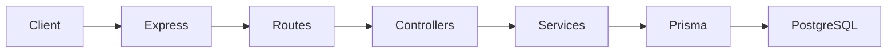
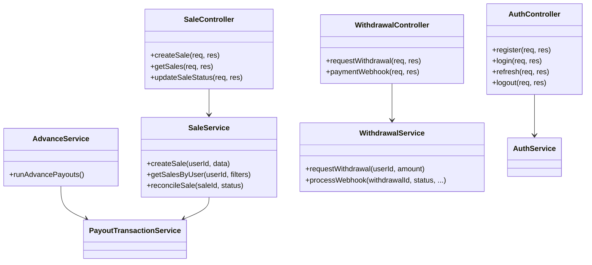
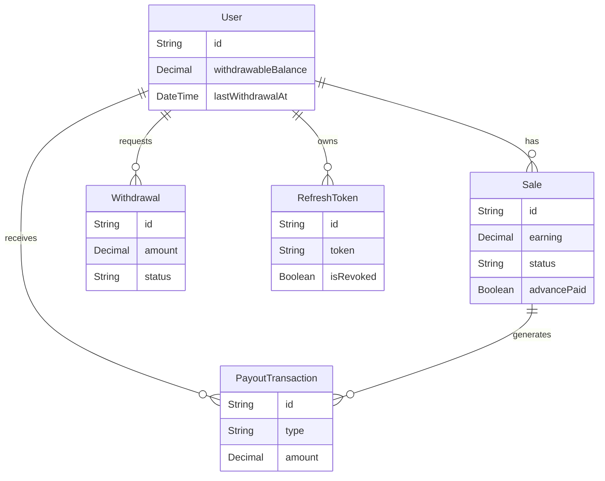
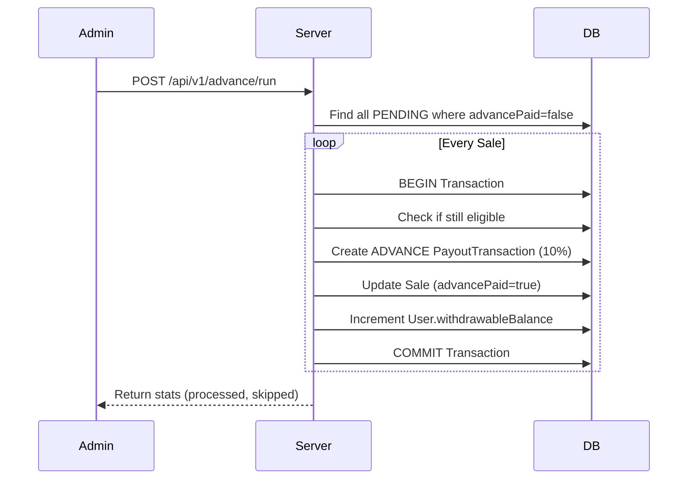

# User Payout Management System

> A backend service for managing affiliate sales, advance payouts, withdrawals, and payout reconciliation. The project demonstrates transactional financial operations, idempotent batch processing, JWT authentication, webhook-driven recovery, and Prisma ORM with PostgreSQL.

## Features
- **JWT Authentication** (via secure `httpOnly` cookies, Refresh Tokens, and revocation)
- **Role-Based Authorization**
- **Affiliate Sales Processing**
- **Advance Payout Processing** (Idempotent Batch Jobs)
- **Sale Reconciliation**
- **Withdrawal Requests**
- **Failed Payout Recovery** (Payment Gateway Webhooks)
- **Prisma Transactions**
- **Pagination**

## Tech Stack
`Node.js`, `Express.js`, `Prisma ORM`, `PostgreSQL`, `JWT`, `Zod`, `bcryptjs`

## Table of Contents
- [Architecture & Diagrams](#architecture--diagrams)
  - [Folder Structure](#folder-structure)
  - [Architecture Flowchart](#architecture-flowchart)
  - [Class Diagram](#class-diagram)
  - [Database Schema (ERD)](#database-schema-erd)
  - [Advance Payout Flow (Sequence)](#advance-payout-flow)
- [Design Decisions & Trade-offs](#design-decisions--trade-offs)
- [API Endpoints](#api-endpoints)
- [Getting Started](#getting-started)
- [Future Improvements](#future-improvements)

---

## Design Decisions & Trade-offs

### 1. Why Prisma Transactions?
**Problem**: Financial operations (like approving a sale or processing a withdrawal) require multiple database mutations (e.g., deducting balance and creating a transaction record).
**Decision**: Every monetary operation is wrapped in an atomic `prisma.$transaction`. This ensures that if the server crashes halfway through, no partial data is committed, preventing scenarios where a user's balance is deducted but the withdrawal record isn't saved.

### 2. Why is Advance Payout Idempotent?
**Problem**: In distributed systems, a cron job or admin could trigger the advance payout batch script multiple times simultaneously.
**Decision**: 
- **Application Level**: The service uses an atomic `updateMany` statement `where: { status: "PENDING", advancePaid: false }`. Even if two processes query the exact same sale, only one will successfully execute the update and proceed to pay.
- **Database Level**: A composite unique constraint `@@unique([saleId, type])` in the `PayoutTransaction` table fundamentally blocks any duplicate `ADVANCE` payments.

### 3. Why a Webhook for Payout Status Updates?
**Problem**: When a user requests a withdrawal, the actual transfer of funds via a payment gateway (like Stripe or Razorpay) is asynchronous.
**Decision**: The withdrawal endpoint only creates a `PENDING` request. The gateway will later hit the `POST /api/withdraw/webhook` endpoint with a final status (`SUCCESS`, `FAILED`, etc.). If it fails, the webhook triggers the refund logic securely.

### 4. Why Decimal was used instead of Float
**Problem**: Floating-point math in JavaScript can introduce precision errors (e.g. `0.1 + 0.2 = 0.30000000000000004`).
**Decision**: In this project, currency is stored securely using Prisma's `Decimal` type (`@db.Decimal(10,2)`). During arithmetic within the application layer, the decimal objects are securely cast and computed. This ensures enterprise-grade mathematical precision and avoids classic floating-point vulnerabilities.

### 5. Negative Balances ("Debt")
**Problem**: What happens if an advance is paid, but the sale is later rejected?
**Decision**: A negative `ADJUSTMENT` transaction is created which deducts from the user's balance. If their balance hits zero, it goes into the negative. This acts as "debt" that automatically nets against future affiliate sales.

### 6. Assumptions
- **Users**: Users authenticate via JWT and cannot select the `ADMIN` role themselves.
- **Brands/Sales**: For simplicity, `brand` is stored as a string. In production, this would be a relational `Brand` table.
- **Batch Processing**: The `findMany` query in the advance service retrieves all eligible sales. In a production system processing millions of rows, this would be refactored into chunked batches or utilize row-level locking.

---

## Architecture & Diagrams

### Folder Structure
**Layered Controller-Service architecture using Prisma ORM.**

```
src/
├── config/         # Environment vars & Prisma client
├── constants/      # Business constants (e.g. payout rates, statuses)
├── controllers/    # Express route handlers (HTTP logic)
├── middlewares/    # Auth, Validation, Authorization, and Pagination
├── routes/         # Express route definitions
├── schemas/        # Zod validation schemas
├── services/       # Core business logic and Prisma transactions
└── utils/          # Error handling & async wrappers
prisma/
├── schema.prisma   # Database schema
└── seed.js         # Seed script for initial setup
```

### Architecture Flowchart


### Class Diagram



### Database Schema (ERD)



### Advance Payout Flow



---

## API Endpoints

### Auth
- `POST /api/v1/auth/register` - Create user
- `POST /api/v1/auth/login` - Get JWT

### Sales (Affiliate side)
- `POST /api/v1/sales` - Submit a new sale
- `GET /api/v1/sales` - View sales & status

### Admin Actions
- `POST /api/v1/advance/run` - Trigger batch advance payouts
- `PATCH /api/v1/sales/:id/status` - Reconcile sale (Approve/Reject)
- `POST /api/v1/withdraw/webhook` - Simulate payment gateway payload (Refunds user if failed)

### Withdrawals
- `POST /api/v1/withdraw` - Request funds (24-hour lock enforced)

---

## Getting Started

1. **Install dependencies**
```bash
npm install
```

2. **Database setup**
```bash
npx prisma generate
npx prisma migrate dev --name init
npm run seed
```
*(The seed script automatically creates an admin and a regular user with pending sales)*

3. **Start the server**
```bash
npm run dev
```


---

## Future Improvements
This implementation follows production-oriented practices, with several areas that could be further enhanced for large-scale deployments:
1. **Message Broker (RabbitMQ/Kafka)**: Instead of the advance cron job processing directly, it could push IDs to a queue to allow distributed workers to process payouts.
2. **Logging**: Integrate `pino` or `winston` for persistent JSON application logs, rather than using standard `console.error`.
